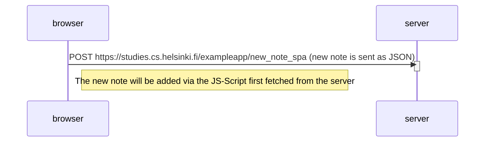

# Exercise 0.6

```mermaid
sequenceDiagram
    participant browser
    participant server

    browser->>server: POST https://studies.cs.helsinki.fi/exampleapp/new_note_spa (new note is sent as JSON)
    activate server
    
    
    deactivate server

    

    Note right of browser: The new note will be added via the JS-Script first fetched from the server
```
